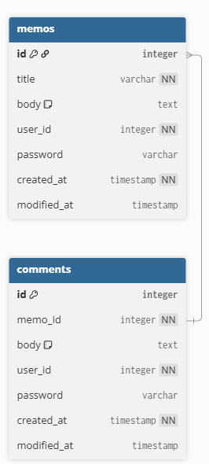

# CH3 일정 관리 앱 만들기


# API 명세


## End-point: 일정 추가
### Method: POST
>```
>{{baseURL}}/memos
>```
### Body (**raw**)

```json
{
    "title": "제목을삼십자로작성합니다내용은이백자로작성합니다아아아아아아",
    "body": "제목을삼십자로작성합니다내용은이백자로작성합니다아아아아아아제목을삼십자로작성합니다내용은이백자로작성합니다아아아아아아제목을삼십자로작성합니다내용은이백자로작성합니다아아아아아아제목을삼십자로작성합니다내용은이백자로작성합니다아아아아아아제목을삼십자로작성합니다내용은이백자로작성합니다아아아아아아제목을삼십자로작성합니다내용은이백자로작성합니다아아아아아아제목을삼십자로작성합니다내용은이백자로작",
    "userId": 1,
    "password": "1234"
}
```


⁃ ⁃ ⁃ ⁃ ⁃ ⁃ ⁃ ⁃ ⁃ ⁃ ⁃ ⁃ ⁃ ⁃ ⁃ ⁃ ⁃ ⁃ ⁃ ⁃ ⁃ ⁃ ⁃ ⁃ ⁃ ⁃ ⁃ ⁃ ⁃ ⁃ ⁃ ⁃ ⁃ ⁃ ⁃ ⁃ ⁃ ⁃ ⁃ ⁃ ⁃ ⁃ ⁃ ⁃ ⁃ ⁃ ⁃

## End-point: 일정 전체 조회
### Method: GET
>```
>{{baseURL}}/memos
>```

⁃ ⁃ ⁃ ⁃ ⁃ ⁃ ⁃ ⁃ ⁃ ⁃ ⁃ ⁃ ⁃ ⁃ ⁃ ⁃ ⁃ ⁃ ⁃ ⁃ ⁃ ⁃ ⁃ ⁃ ⁃ ⁃ ⁃ ⁃ ⁃ ⁃ ⁃ ⁃ ⁃ ⁃ ⁃ ⁃ ⁃ ⁃ ⁃ ⁃ ⁃ ⁃ ⁃ ⁃ ⁃ ⁃ ⁃

## End-point: 일정 사용자아이디로 조회
### Method: GET
>```
>{{baseURL}}/users/1/memos
>```

⁃ ⁃ ⁃ ⁃ ⁃ ⁃ ⁃ ⁃ ⁃ ⁃ ⁃ ⁃ ⁃ ⁃ ⁃ ⁃ ⁃ ⁃ ⁃ ⁃ ⁃ ⁃ ⁃ ⁃ ⁃ ⁃ ⁃ ⁃ ⁃ ⁃ ⁃ ⁃ ⁃ ⁃ ⁃ ⁃ ⁃ ⁃ ⁃ ⁃ ⁃ ⁃ ⁃ ⁃ ⁃ ⁃ ⁃

## End-point: 일정 단건 조회
### Method: GET
>```
>{{baseURL}}/memos/1
>```

⁃ ⁃ ⁃ ⁃ ⁃ ⁃ ⁃ ⁃ ⁃ ⁃ ⁃ ⁃ ⁃ ⁃ ⁃ ⁃ ⁃ ⁃ ⁃ ⁃ ⁃ ⁃ ⁃ ⁃ ⁃ ⁃ ⁃ ⁃ ⁃ ⁃ ⁃ ⁃ ⁃ ⁃ ⁃ ⁃ ⁃ ⁃ ⁃ ⁃ ⁃ ⁃ ⁃ ⁃ ⁃ ⁃ ⁃

## End-point: 일정 단건 수정
### Method: PUT
>```
>/memos/1
>```
### Body (**raw**)

```json

```


⁃ ⁃ ⁃ ⁃ ⁃ ⁃ ⁃ ⁃ ⁃ ⁃ ⁃ ⁃ ⁃ ⁃ ⁃ ⁃ ⁃ ⁃ ⁃ ⁃ ⁃ ⁃ ⁃ ⁃ ⁃ ⁃ ⁃ ⁃ ⁃ ⁃ ⁃ ⁃ ⁃ ⁃ ⁃ ⁃ ⁃ ⁃ ⁃ ⁃ ⁃ ⁃ ⁃ ⁃ ⁃ ⁃ ⁃

## End-point: 일정 단건 삭제
### Method: DELETE
>```
>{{baseURL}}/memos/1
>```

⁃ ⁃ ⁃ ⁃ ⁃ ⁃ ⁃ ⁃ ⁃ ⁃ ⁃ ⁃ ⁃ ⁃ ⁃ ⁃ ⁃ ⁃ ⁃ ⁃ ⁃ ⁃ ⁃ ⁃ ⁃ ⁃ ⁃ ⁃ ⁃ ⁃ ⁃ ⁃ ⁃ ⁃ ⁃ ⁃ ⁃ ⁃ ⁃ ⁃ ⁃ ⁃ ⁃ ⁃ ⁃ ⁃ ⁃

## End-point: 댓글 추가
### Method: POST
>```
>{{baseURL}}/memos/1/comments
>```
### Body (**raw**)

```json
{
    "body": "으악으악으악",
    "userId": 1,
    "password": "1234a"
}
```


⁃ ⁃ ⁃ ⁃ ⁃ ⁃ ⁃ ⁃ ⁃ ⁃ ⁃ ⁃ ⁃ ⁃ ⁃ ⁃ ⁃ ⁃ ⁃ ⁃ ⁃ ⁃ ⁃ ⁃ ⁃ ⁃ ⁃ ⁃ ⁃ ⁃ ⁃ ⁃ ⁃ ⁃ ⁃ ⁃ ⁃ ⁃ ⁃ ⁃ ⁃ ⁃ ⁃ ⁃ ⁃ ⁃ ⁃

## End-point: 메모와 댓글 같이 조회
### Method: GET
>```
>undefined
>```

⁃ ⁃ ⁃ ⁃ ⁃ ⁃ ⁃ ⁃ ⁃ ⁃ ⁃ ⁃ ⁃ ⁃ ⁃ ⁃ ⁃ ⁃ ⁃ ⁃ ⁃ ⁃ ⁃ ⁃ ⁃ ⁃ ⁃ ⁃ ⁃ ⁃ ⁃ ⁃ ⁃ ⁃ ⁃ ⁃ ⁃ ⁃ ⁃ ⁃ ⁃ ⁃ ⁃ ⁃ ⁃ ⁃ ⁃


# ERD
Table memos {  
id integer [primary key]  
title varchar [not null]  
body text [note: 'Content of the memos']  
user_id integer [not null]  
password varchar  
created_at timestamp [not null]  
modified_at timestamp  
}  

Table comments {  
id integer [primary key]  
memo_Id integer [not null]  
body text [note: 'Content of the comments']  
user_id integer [not null]  
password varchar  
created_at timestamp [not null]  
modified_at timestamp  
}  
Ref: "comments"."memo_Id" < "memos"."id"



## 주의사항
- 일정 작성, 수정, 조회 시 반환 받은 일정 정보에 `비밀번호`는 제외해야 합니다.
- 일정 수정, 삭제 시 선택한 일정의 `비밀번호`와 요청할 때 함께 보낸 `비밀번호`가 일치할 경우에만 가능합니다.
